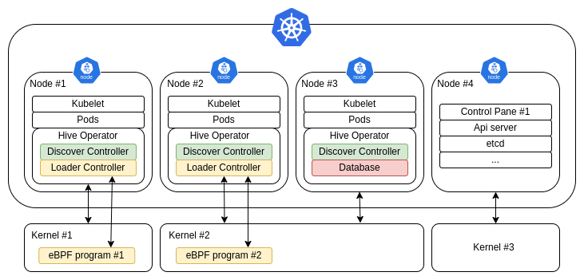

# Design Document

This document contains all the information necessary to understand
the application and Its implementation. It explains the design
decisions and how the different components interact with one another
and with other systems.

After reading this document, you will gain a good understanding of how
the application operates.

# Index

- [Overview](#overview)
  - [Application Description](#description)
  - [Components](#components)
  - [How to monitor accesses to files](#accesses)
  - [How to uniquely identify a file](#identify)
  - [Kubernetes makes things harder](#complications)
  - [Example](#example)
  - [Overview of eBPF](#ebpf-overview)
  - [Overview of Kubernetes](#kubernetes-overview)
- [Detailed description](#detailed-description)
  - [Design Considerations](#design-considerations)
  - [Discover Controller](#discover-controller)
    - [Number of discover controllers](#number-of-discover-controller)
    - [HivePolicy Resource](#hivepolicy-resource)
      - [Path](#hivepolicy-resource-path)
      - [Create](#hivepolicy-resource-create)
      - [Match](#hivepolicy-resource-match)
    - [HivePolicy Reconciliation](#hivepolicy-reconciliation)
  - [Loader Controller](#loader-controller)
    - [Number of loader controllers](#number-of-loader-controller)
    - [HiveData Resource](#hivedata-resource)
    - [HiveData Reconciliation](#hivedata-reconciliation)
  - [eBPF program](#ebpf-program)
  - [Pod Controller](#pod-controller)

<a name="overview"></a>
# Overview

This section contains a brief description of how the application
works, Its parts and how they interact with each other.

<a name="description"></a>
## Application Description

Hive is a kubernetes-native eBPF-based file access monitoring
tool. The user is able to select which file to monitor based on the
path and filters on pods / containers. When one of the monitored files
is accessed (read from, written to...), the application will inform
the user by generating an alert.

**User story**: I, as the user of the application, want to log
all the `processes` that access the file `/etc/shadow` on pods
that have the `security=high` label.

<a name="components"></a>
## Components

The application is implemented as a single kubernetes operator and is
structured into multiple components that interact with each other,
kubernetes or the operating systems.

The components are:

- **discover controller**: collects identifying data of the files to
  monitor. Manages the `HivePolicy` resource.
- **loader controller**: loads and updates the eBPF program into the
  kernel. Generates the `HiveAlerts` and manages the `HiveData`
  resource.
- **eBPF program**: informs the loader that one of the monitored files
  was accessed, with additional information from the kernel.
- **pod controller**: reacts to changes in the pods to update the other
  resources.

A detailed description of the aforementioned components is given later
in this document.

<a name="accesses"></a>
## How to monitor accesses to files

Briefly, the end goal is to log when a file is accessed, that is, when
an actor interacts with It by opening, closing, writing, appending and
so on.

The application uses eBPF programs to monitor accesses. More
specifically, the eBPF program gets executed when a certain kernel
function is called through a kprobe, and It will check if said
function interacts with any of the files specified by the user. If
that is the case, It should log the information with additional
metadata such as which PID called the function.

The information on which files to check is provided from userspace to
the eBPF program via a map, which is a shared array between userspace
and kernelspace (in both directions).

If you are new to eBPF, you can think of them as simple "trusted"
programs that run inside the kernel. They can access some
internal kernel information that would only be available through
kernel modules which are more powerful and, therefore, dangerous.

The eBPF program needs to be loaded and updated when the user changes
the monitoring policy (`HivePolicy`) or the cluster changes / updates
its topology. Rherefore a loader and an updater are necessary, which
are both done by the *loader controller*, as well as capturing
information from the eBPF program and generating alerts
(`HiveAlert`). A more satisfying description will be given later.

<a name="identify"></a>
## How to uniquely identify a file

To identify a particular file, we can use Its path name. There cannot
be two different files with the same path name, however you can create
a symlink to a file: the path of the symlink will be different from
the path of the original file but the actual data will be the same.

To circumvent this, we are using the inode number instead.  Each file
has an inode number that is unique in the filesystem that he lives
in. This is how the kernel internally identifies data.

However, there is still an edge case where different filesystems may
have different files with the same inode number. This happens because
the inode number is an identifier in a filesystem, but It has no
meaning on another filesystem and may aswell point to a different
file.

To solve this problem, we can save both the inode number and the
device id, which will be different for each filesystem unless the
filesystem has been bind mounted. In this last case, from the user
perspective, the binded filesystem and the filesystem onto which the
binded one is mounted have different inode numbers so this is enough.

Yet, this does not really hold for all filesystem, namely BTRFS.
Indeed BTRFS may choose to have multiple internal device ids for the
user filesystem. When `stat` is called, a call to a BTRFS function is
done, which we cannot do in an eBPF program therefore we cannot access
the userspace device id number. I got this issue during testing and It
does not appear to be a solution, therefore we will fallback to only
inode numbers.

In our application, the logic that is responsible to get the inode
number is the *discover controller*. The loader controller and the
discover controller share information through a `HiveData` resource.

<a name="complications"></a>
## Kubernetes makes things harder

Now, imagine all that we have just said, but inside containers in a
very dynamic environment where things may change and break at any
time.  There may be multiple operating systems so we need to load one
eBPF program for each one of them but not more than one on the same
kernel. We need to access inode numbers of files inside containers,
pods can be scheduled in any node, and so on. All of this needs to
be handled carefully, increasing the complexity of the design.

<a name="example"></a>
## Example

An example deployment would look like the following:



On the picture, notice that Kernel #2 only has one loader. Each kernel
has only one loader, which is chosen through elections. Instead, the
discover controller is active in each node because It has to find
information about other pods that may be scheduled in each node.
There is only one pod controller on the entire cluster. The control
pane does not have an operator normally, but can configure It to run
pods like a normal node; if this is enabled, the operator will be
scheduled to this node too.

<a name="ebpf-overview"></a>
## Overview of eBPF

eBPF programs are programs that run inside the kernel in a controlled
environment. They can be hooked to traditional tracing systems such as
tracepoints, perf events and kprobes, and they will be executed when
the hook is triggered. An eBPF program has its own [instruction
set](https://www.ietf.org/archive/id/draft-thaler-bpf-isa-00.html),
programs are limited to having at most 512 Bytes of stack size and 1
million instruction, unbounded loops are not allowed, functions can
have up to 5 arguments and only certain functions (helpers or
kfunctions) can be called.  Note that those (and many other)
limitations are changing rapidly and the kernel verifier is getting
always smarter, allowing for softer limits.

Usually you do not write bytecode directly; instead you let a
compiler generate it for you. Traditionally, [BCC](https://github.com/iovisor/bcc)
is used to compile said programs, however, both LLVM and GCC have caught
up and now provide an eBPF target.

A fundamental change to the eBPF ecosystem was made with the
introduction of the Bpf Type Format (BTF) which enables CO-RE (Compile
Once, Run Everywhere). Using BTF will enable the program to work on
any kernel version. User space provides eBPF programs to the kernel
via the `bpf(2)` syscall, which will verify that the program is
correct (enforcing the limitations) and will proceed to JIT compile
it to native instructions.

People have been using eBPF mostly for tracing purposes. However, in
recent times people are exploring its usage more broadly as the
programs are becoming more capable.

<a name="kubernetes-overview"></a>
## Overview of Kubernetes

Kubernetes is a declarative container management software. The user
specifies the desired state of the cluster and kubernetes will try to
update the current state to the desired state. Applications should
expect to be interrupted at any time and failures should be handled
gracefully.  Kubernetes can work with multiple container runtimes such
as containerd or podman, and interacts with the containers through
their runtime (for example, via a containerd client). Therefore,
kubernetes abstracts the management of single container, and focuses
on the scheduling and setting up of containers in a physical or
logical cluster.

Each unit on the cluster is called a *node*. There are two kinds of
nodes: a worker node and the control pane. The former will run the
user's applications and services through contianers grouped in *pods*,
the latter forms the backbone of the kubernetes cluster and is
responsible for central management of the workers. The most important
components are the api server (which the kubelet use to communicate
with the control pane) etcd (a highly-available key-value store),
scheduler and a controller manager which manages all of the above.

A common pattern found in kubernetes is the Operator, which is a
custom controller that manages some resources called *custom resources*
and extends the behavior of the cluster. Note that the same operator
may have multiple controllers for different custom resources, as we
will see later.

<a name="detailed-description"></a>
# Detailed description

This section describes the application in more depth. It is
recommended to read the overview section first in order to get a
general understanding of the application before reading the details.

<a name="design-considerations"></a>
## Design Considerations

The design of this application was conducted considering the following:
- the cluster runs on one or more linux operating systems
- one operating system may host one or more nodes (for example, a
  cluster with [kind](https://kind.sigs.k8s.io/))
- each node runs Its own container runtime
- pods may be scheduled and rescheduled in any node with any number
  of replicas

The different components are now described below:

<a name="discover-controller"></a>
## Discover Controller

The *discover* controller aka `HivePolicy` controller is responsible for
the following:

- Identify the kernel instance: the controller will fetch an unique
  identifier for the running kernel (for example reading
  `/proc/sys/kernel/random/boot_id`).
       
   This is needed because the loader should send to the eBPF program
   only the inodes that exist on the running kernel. In other words,
   and inode makes sense only in the kernel where It runs. Therefore,
   the discover controller needs to identify Its running kernel in
   order to share the inodes with the right loader (there is one
   loader per running kernel, more info below).

- reacting to CRUD operations on `HivePolicy` resource, which will:

  - Fetch files' information such as the inode number from the
    matched contianers, hence the name *discover*
  - Create `HiveData` resources with the previously fetched information

The `HiveData` resource is specified later in [HiveData resource](#hivedata-resource).

Note that when referring to "inodes" in this document we are technically
referring to the inode number.

<a name="number-of-discover-controller"></a>
### Number of discover controllers

There must be one discover controller for each node. This is necessary
because the controller has to interface directly to the container
runtime and access the containers' filesystem in order to read the
inode.

Therefore, each discover controller instance will react to all the
changes in the `HivePolicy` resource, and generate one or multiple
`HiveData` resource[s] for this specific kernel.

Any discover controller[s] may generate multiple `HiveData` resources
from the same `HivePolicy`. This is intended by design since the
policy may match multiple pods hence the relationship between a policy
and a `HiveData` is *one to many*.

<a name="hivepolicy-resource"></a>
### HivePolicy Resource

A `HivePolicy` resource contains a list of `HiveTrap`, and looks like
this:

```yaml
apiVersion: hive-operator.com/v1alpha1
kind: HivePolicy
metadata:
  labels:
    app.kubernetes.io/name: hive-operator
  finalizers:
    - hive-operator.com/finalizer
  name: hive-sample-policy
  namespace: hive-operator-system
spec:
  traps:
    - path: /secret.txt
      create: true
      mode: 444
      callback: "http://my-callback.com/alerts"
      match:
        pod: nginx-pod
        namespace: default
        ip: 192.168.0.3
        container-name: ".*"
        matchLabels:
          security-level: high
```

Each `HiveTrap` could contains the following fields:

<a name="hivepolicy-resource-path"></a>
#### Path

This is the only non-optional fiels. `path` is the filesystem path in
a matched container starting from the root `/` directory of the file
to trace.

<a name="hivepolicy-resource-create"></a>
#### Create

The user may decide to create the file if not present by specifying
`create: true` in the policy. Furthermore, the user can specify the
UNIX permissions given to the file to be created via the `mode` field.

#### Callback

If present, the operator will send json-encoded data to the callback
via an HTTP POST request.

<a name="hivepolicy-resource-match"></a>
#### Match

The operator should assume that all the pods are selected unless
optional filters are specified.  The optional filters are specified
under the `match` field and are the following:

- `pod`: the name of the pod
- `namespace`: the namespace of the pod
- `container-name`: a regex to match the name of containers
- `ip`: the ipv4 of the pod
- `matchLabels`: a list of labels and values

<a name="hivepolicy-reconciliation"></a>
### HivePolicy Reconciliation

The controller performs the following actions in sequence when a CRUD
operation occurs on an `HivePolicy` resource (a "reconciliation"):

1. Identify the kernel instance: the controller will fetch an unique
   identifier for the running kernel (for example reading
   `/proc/sys/kernel/random/boot_id`).
       
   This is needed because the loader should send to the eBPF program
   only the inodes that exist on the running kernel. In other words,
   and inode makes sense only in the kernel where It runs. Therefore,
   the discover controller needs to identify Its running kernel in
   order to share the inodes with the right loader (there is one
   loader per running kernel, more info below).
   
   This is node only once at startup.

2. Initialize a connection with the container runtime of the kubelet
   where the controller lives, if not previously done. Interfacing to
   the container runtime is necessary to know which PID corresponds to
   which container, and through the PID we can access the filesystem.

3. Read all the `HivePolicies` and their respective `HiveTraps`.

4. If an `HivePolicty` is about to be deleted (using finalizers),
   trigger a reconciliation for `HiveData`, which will be responsible
   for deleting any resource that does not belong anymore to a
   `HiveTrap`.

5. For each trap, get the list of matched containers, then check if
   a `HiveData` resource already exists for each of them.
   
   If it does not exist:
   
   - Read the inode of the file specified by the trap.
     
   - Create the `HiveData` with the information from the container,
     the pod, the trap, the policy, and the inode.

   - Compute an identifier of the policy and set it as a label in the
     `HiveData`.

   If either the container or pod are not ready, requeue and restart
   from point 2.

To summarize, if an `HivePolicy` is created / updated, the reconciliation
will check if a `HiveData` was already present, or create it otherwise.
If an `HivePolicy` is deleted, we delegate the responsibility of deleting
old `HiveData` to the `HiveData` reconciliation.

<a name="loader-controller"></a>
## Loader Controller

The loader controller aka `HiveData` controller is responsible for the
following operations:

- Load the eBPF program at startup and unload It during shutdown.
- Update the eBPF map when there is a change in a `HiveData` resource.
- Generate `HiveAlerts`: the controller will read the output of the
  eBPF program from a ring buffer, parse it, add kubernetes
  information (such as the name of the pod corresponding to the inode
  and other information from the kubernetes topology) and generate an
  `HiveAlert`, which will either be printed to standard output or sent
  to a callback via a POST HTTP request.

Upon rescheduling of the operator, the eBPF program needs to be
reloaded (closed and loaded again).

<a name="number-of-loader-controllers"></a>
### Number of loader controllers

There must be one loader controller for each running kernel. This is
necessary because the loader interacts directly with the running
kernel. It is useless to have multiple loaders in the same kernel,
but at least one is necessary to load the eBPF program.

To implement this, each node needs to fetch Its running kernel
identifier and then run elections so that only one node is elected per
running kernel.

<a name="hivedata-resource"></a>
### HiveData Resource

The `HiveData` resource is used to communicate information between the
discover and the loader controller. The relationship between an
`HiveTrap` and an `HiveData` is one to many, where each `HiveData`
must have an `HiveTrap`.

The loader uses information from this resource to instruct the eBPF
program to filter certain inodes.

The schema of the resource looks like the following:

```bash
apiVersion: hive-operator.com/v1alpha1
kind: HiveData
metadata:
  annotations:
    callback: ""
    container_id: containerd://da9e46ae1873ec463c9dafd08d2be762867e92b740b5c5b4534c6ad0c270d1e5
    container_name: nginx
    hive_policy_name: hive-sample-policy
    namespace: default
    node_name: hive-worker2
    path: /secret.txt
    pod_ip: 10.244.1.2
    pod_name: nginx-pod
  creationTimestamp: "2025-07-25T08:06:12Z"
  generation: 1
  name: hive-data-nginx-pod-default-13667586
  namespace: hive-operator-system
  resourceVersion: "23395"
  uid: 788bcb67-a9de-480d-a179-e40234116459
  labels:
      trap-id: c4705ec263cc353100b6f18a129e32b67b79171bcb0c90b2731a7923ea4dcee
spec:
  inode-no: 13667586
  kernel-id: fc9a30d5-6140-4dd1-b8ef-c638f19ebd71
```

The fields, all under the `spec` one, are the following:
- `inode-no`: The inode number of the file to trace, needed by the
  eBPF program.
- `kernel-id`: An unique identifier of a running kernel, to discriminate
  which loader controller should handle this `HiveData`.

The annotations are used as additional information for the `HiveAlert`
when an access is detected by the eBPF program.

The `trap-id` is used to identify which `HiveTrap` generated this
`HiveData`.

<a name="hivedata-reconciliation"></a>
### HiveData Reconciliation

Upon CRUD changes of the `HiveData` resource, the controller does the
following:

1. Fetch the `HivePolicy` and `HiveData` resources in the cluster.

2. Check if each `HiveData` (referring to this kernel id) does have a
   corresponding `HiveTrap` from an `HivePolicy`.
  
  If it does, then we update the eBPF map with the information from
  the `HiveData`. It it doesn't, then the `HiveTrap` has been
  eliminated and the `HiveData` should be deleted.
  
3. Fill the rest of the eBPF map with zeros so that we do not leave
   old values that where there before.

<a name="ebpf-program"></a>
## eBPF program

To check whether an actor has interacted with a file, the eBPF program
hooks to the function `inode_permission` through a keyprobe. This
function gets called every time the permissions of an inode are
checked in the kernel, which appends before any operation on them. It
allows the eBPF program to log when a permission is checked and with
what rights, as well as who tried to check the permissions.

The eBPF program will log information only if said function is called
on an inode present in an `HiveData` resource.  The loader will fetch
those inodes from the CRD and send them to the eBPF program via a map,
that is an array of inodes.

The info is sent in a kernel ringbuffer accessible by the operator
for logging purposes.

The eBPF program uses BTF types information to enable compile-once
run everywhere (CORE) meaning that the ebpf program does not need
to be compiled each time It needs to be loaded, but can be compiled
only once and even shipped with the binaries of the application.

The information from the ring buffer will be processed by the loader
to generate an `HiveAlert`. An example alert is the following:

```
{
  "timestamp": "2025-07-25T08:14:22Z",
  "hive_policy_name": "hive-sample-policy",
  "metadata": {
    "path": "/secret.txt",
    "inode": 13667586,
    "mask": 34,
    "kernel_id": "fc9a30d5-6140-4dd1-b8ef-c638f19ebd71"
  },
  "pod": {
    "name": "nginx-pod",
    "namespace": "default",
    "contianer": {
      "id": "containerd://9d7df722223a4ad7f67f2afef5fbc0e263e23c7921011497f445e657fbced97e",
      "name": "nginx"
    }
  },
  "node": {
    "name": "hive-worker2"
  },
  "process": {
    "pid": 61116,
    "tgid": 61164
  }
}
```

<a name="pod-controller"></a>
## Pod Controller

When a pod is changed, we want to update both `HiveData` and the eBPF
map. To achieve, this we need a pod controller. There are two main
operations we are concerned about with pods: pod creation and pod
termination.
- creation: upon creation, the controller should send a
  reconcile request for `HivePolicy` so that new `HiveData` will
  be generated for the new pod.
- termination: upon termination, the controller should check if
  each `HiveData` refers to an existing pod. If it doesn't, then
  that resource should be eliminated.
  
Failures are treated as terminations.

The implementation of said logic is achieved through a reconcile
function like other controllers.

Since Pods are global resources accessed from anywhere, we need only
one pod controller in the cluster. This is the sole reason why we need
a separate controller from the others: there is a discover controller
on each system, a loader controller on each running kernel, and a
single pod controller per cluster.
